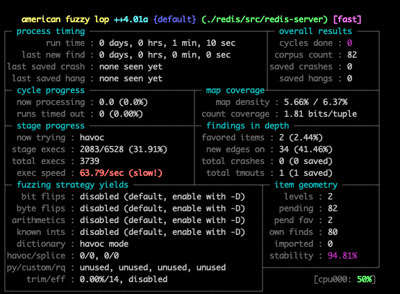

# redis-afl
An automated(+beginner friendly) setup for fuzzing Redis w/ AFL++.

To read more about my 1st time fuzzing experience, [see this blogpost](fuzzing-redis-url)

# Build
To build, run:
```sh
docker build -t afl-redis-setup .
```

To start the container with a shared volume (in order for the results to be saved in the hosting machine)

```sh
docker run --rm -v $(pwd):/root/host-share --privileged -it --workdir=/root afl-redis-setup
```

# Test

To run a smoke test before starting the fuzzing session, run:
```sh
AFL_PRELOAD=preeny/x86_64-linux-gnu/desock.so afl-showmap -m2048 -o/dev/null ./redis/src/redis-server ./redis.conf < <(echo "PING");

output:
[+] Hash of coverage map: 5a20352f5b1cb7e5
[+] Captured 1156 tuples (map size 38422, highest value 8, total values 2511) in '/dev/null'.
```

```sh
AFL_PRELOAD=preeny/x86_64-linux-gnu/desock.so afl-showmap -m2048 -o/dev/null ./redis/src/redis-server ./redis.conf < <(echo "SHUTDOWN");

output:
[+] Hash of coverage map: 653954010db919f3
[+] Captured 1170 tuples (map size 38422, highest value 8, total values 2553) in '/dev/null'.
```

# Run

To start fuzzing, just run `./fuzz.sh` file :^) 



>**Note:** The fuzzing speed/execs per second will not be high if you don't have a strong machine. This can be solved in two approaches: The first approach is '_Trying Harder_', to apply this, just keep reading through the _Distributed Fuzzing_ section below. The 2nd approach is '_Trying Smarter_', this approach involves patching the server in a more specific way that cuts down the performance costs, more about it can be found [in this blogpost](fuzzing-smarter-post-url). 

# Distributed Fuzzing

To run multiple instances of AFL++, use [afl-launch](https://github.com/bnagy/afl-launch#installation) and specify number of cores using the ``-n`` argument:
```sh
AFL_PRELOAD=./preeny/x86_64-linux-gnu/desock.so ~/go/bin/afl-launch -n $(nproc) -i ./input/ -o output/ -x ./dict/ -m 2048 ./redis/src/redis-server ./redis.conf
```

# Areas for improvement

The setup in this repo is based on [VolatileMinds approach from 2015](https://volatileminds.net/2015/08/20/advanced-afl-usage-preeny.html), I also added some useful improvements(below)

- [X] Upgrading to a modern version(from 3.1 to 6.2.1)
- [X] Automating the build proccess & hot-patch of Redis and preeny
- [X] Adding instructions for scaled/Distributed Fuzzing
- [X] Fixing compile flags for easier crash analysis (now side-dependencies are compiled with debug information, such as the embedded lua interpreter, etc.)
- [X] Use `AFL_PRELOAD` instead of `LD_PRELOAD` (although I didn't notice a change, some docs are suggesting to use ``AFL_PRELOAD`` since ``LD_PRELOAD`` might override the fuzzer binary and possibly make the fuzzer melt into itself)
- [ ] Adding more samples for the `./input/` directory
- [ ] Applying persistent fuzzing(`AFL_LOOP`) to increase the _execs per second_ rate
- [ ] Adding utils like _AddressSanitizer_(ASAN) _UndefinedBehaviorSanitizer_(UBSAN) to the final build

